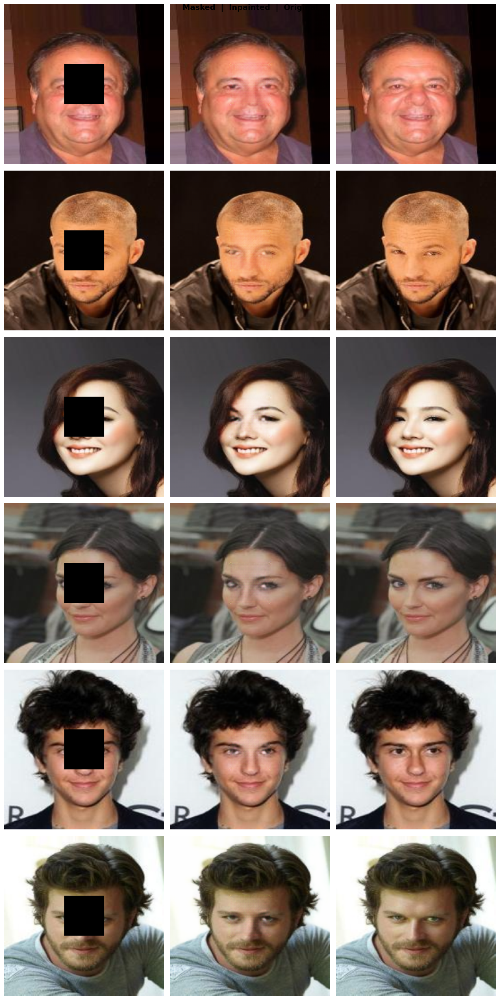
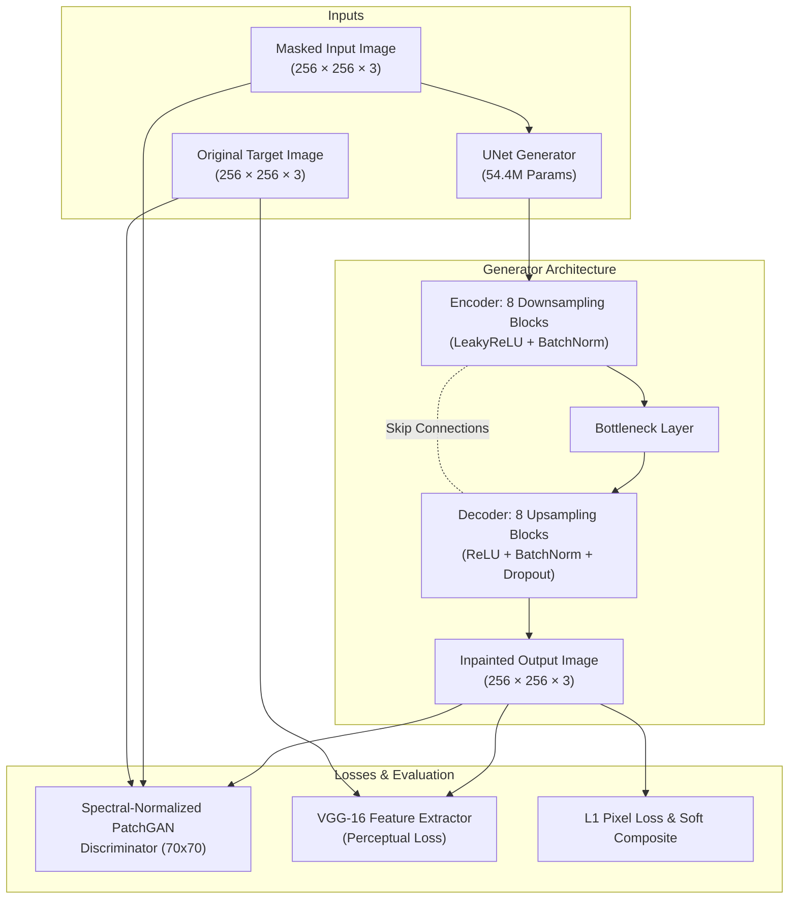
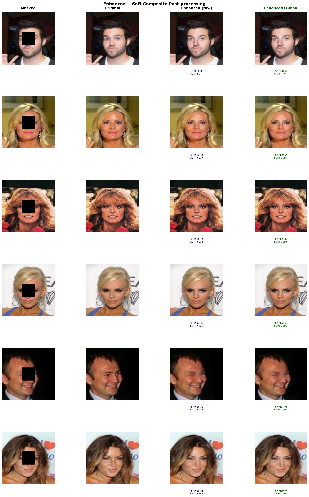

# Image Inpainting using Conditional Generative Adversarial Networks (cGANs)

[](https://www.python.org/)
[](https://pytorch.org/)
[](#architecture-overview)
[](#course-context--workflow)
[](LICENSE)

An end-to-end Generative AI project for **Image Inpainting** developed for the **CS-300** course. This repository implements an enhanced **pix2pix (Conditional GAN)** architecture featuring an **8-Stage UNet Generator with Skip Connections**, a **Spectral-Normalized PatchGAN Discriminator**, a **Compound Objective Function (Adversarial + L1 + VGG-16 Perceptual Loss)**, and a **Soft-Composite Feathering Post-Processing Engine**.

Trained over **116 epochs** on the **CelebA dataset**, achieving a peak evaluation score of **29.01 dB PSNR** and **0.998 SSIM**.

---

## Executive Summary & Key Results

| Metric | Score / Value | Description |
| :--- | :--- | :--- |
| **Generator Parameters** | `54,414,531` (~54.4M) | 8-Stage UNet Encoder-Decoder |
| **Discriminator Type** | 70x70 PatchGAN | Enhanced with Spectral Normalization (`spectral_norm`) |
| **Best Peak PSNR** | **`29.01 dB`** | Evaluated on CelebA test set |
| **Best Peak SSIM** | **`0.998`** | High structural fidelity reconstruction |
| **Average Test PSNR** | **`28.63 dB`** | Evaluated over random test samples |
| **Training Epochs** | `116 Epochs` | Multi-stage refinement with Google Drive sync |
| **Post-Processing** | Soft Compositing | Cosine alpha feathering for edge seam elimination |

---

## Qualitative Visual Results

Below are actual reconstruction samples generated by the model on unseen test images from the CelebA dataset:

### 1. Model Reconstructions (Masked | Inpainted Output | Ground Truth)


*Figure 1: Comparison between Masked Input (Center 64x64 mask), cGAN Inpainted Output, and Ground Truth target image. The network successfully reconstructs complex facial features like eyes, mouth, and skin texture.*

---

## Architecture Overview



### 1. Generator (`UNet Generator`)
- **Encoder**: 8 convolutional downsampling stages with stride 2 and LeakyReLU (\(\alpha = 0.2\)).
- **Decoder**: 8 transposed convolutional upsampling stages with skip-connection concatenations from corresponding encoder levels to preserve spatial high-frequency details.
- **Activation**: Tanh activation on final layer producing normalized RGB images in range \([-1, 1]\).

### 2. Discriminator (`DiscriminatorSN`)
- **PatchGAN**: 70×70 receptive field PatchGAN classifying whether local image patches are real or generated.
- **Spectral Normalization**: All convolutional layers are wrapped with `spectral_norm` to satisfy the 1-Lipschitz condition, ensuring stable cGAN training dynamics without mode collapse.

---

## Mathematical Formulation & Loss Functions

The network is trained using a compound loss function balancing adversarial quality, pixel-level fidelity, and high-level perceptual feature representation:

\[
\mathcal{L}_{\text{Total}} = \mathcal{L}_{\text{cGAN}}(G, D) + \lambda_{\text{L1}} \mathcal{L}_{\text{L1}}(G) + \lambda_{\text{perc}} \mathcal{L}_{\text{Perceptual}}(G)
\]

### 1. Conditional GAN Adversarial Loss (\(\mathcal{L}_{\text{cGAN}}\))
\[
\mathcal{L}_{\text{cGAN}}(G, D) = \mathbb{E}_{x, y}[\log D(x, y)] + \mathbb{E}_{x}[\log (1 - D(x, G(x)))]
\]

### 2. L1 Reconstruction Loss (\(\mathcal{L}_{\text{L1}}\), \(\lambda_{\text{L1}} = 100\))
\[
\mathcal{L}_{\text{L1}}(G) = \mathbb{E}_{x, y, z}[\| y - G(x, z) \|_1]
\]

### 3. VGG-16 Perceptual Loss (\(\mathcal{L}_{\text{Perceptual}}\), \(\lambda_{\text{perc}} = 10\))
\[
\mathcal{L}_{\text{Perceptual}}(G) = \frac{1}{C_j H_j W_j} \| \phi_j(y) - \phi_j(G(x)) \|_2^2
\]
Where \(\phi_j\) represents the feature map activation from layer `features[16]` of a pre-trained VGG-16 network.

---

## Soft Compositing & Feathering Engine

To eliminate boundary artifacts between generated inpainting regions and original unmasked borders, a custom **Soft Compositing / Cosine Feathering** function is applied:



*Figure 2: Visual comparison of raw patch replacement versus soft compositing feathering. Cosine alpha blending smooths seam boundaries to achieve natural texture continuity.*

1. A smooth 2D alpha mask \(A\) with cosine transition weights is constructed over the mask bounding box.
2. The final blended image \(I_{\text{composite}}\) is calculated as:
   \[
   I_{\text{composite}} = A \odot G(x) + (1 - A) \odot y
   \]
3. This process guarantees seamless edge continuity and natural skin texture transitions.

---

## Course Context & Workflow (CS-300)

This project was developed through the following systematic milestones:

1. **Literature Survey & Paper Reading**:
   - *Generative Adversarial Nets* (Goodfellow et al., 2014)
   - *Conditional Generative Adversarial Nets* (Mirza & Osindero, 2014)
   - *Image-to-Image Translation with Conditional Adversarial Networks* (Isola et al., 2016 - pix2pix)
2. **Tech Stack Mastery**:
   - Python 3.10+, PyTorch, Torchvision, NumPy, Matplotlib, PIL.
3. **Prototype Implementation**:
   - Initial UNet prototype implementation and Kaggle setup (`pix2pix_proto.ipynb`).
4. **Enhanced Architecture & Multi-Stage Training**:
   - Integration of Spectral Normalization (`DiscriminatorSN`), VGG-16 Perceptual Loss, and 116-epoch multi-stage training (`Image_Inpainting (4).ipynb`).
5. **Post-Processing & Evaluation**:
   - Implementation of soft composite feathering, PSNR (29.01 dB), SSIM (0.998), and quantitative visual comparison generation.

---

## Repository Structure

```
Image-Inpainting-Project/
├── README.md                     # Comprehensive project documentation & visual results
├── PROJECT_REPORT.md             # Formal academic report for CS-300 submission
├── assets/                       # High-resolution result image showcase
│   ├── inpainting_test_results.png
│   └── soft_composite_feathering.png
├── Image_Inpainting (4).ipynb   # Final PyTorch notebook (116 Epochs, VGG-16, Spectral Norm)
└── pix2pix_proto.ipynb           # Initial course prototype notebook
```

---

## How to Run

### Prerequisites
- Python 3.8+ or Google Colab / Kaggle GPU environment (T4 / P100 / V100 GPU recommended)
- `torch`, `torchvision`, `numpy`, `matplotlib`, `PIL`, `IPython`

### Quick Start on Google Colab or Kaggle
1. Upload `Image_Inpainting (4).ipynb` to Google Colab or Kaggle.
2. Ensure GPU acceleration is enabled (`Runtime -> Change runtime type -> T4 GPU`).
3. Execute all cells sequentially:
   - **Data Setup**: Downloads and extracts the CelebA dataset.
   - **Model Instantiation**: Builds Generator (54.4M params) & Spectral-Normalized Discriminator.
   - **Training / Resume**: Trains or resumes from `final_checkpoint.pth`.
   - **Inference & Testing**: Generates test grids, loss curves, and soft-composite comparisons.

---

## References & Citations
- **Goodfellow, I., et al.** (2014). *Generative Adversarial Nets*. NIPS.
- **Mirza, M., & Osindero, S.** (2014). *Conditional Generative Adversarial Nets*. arXiv:1411.1784.
- **Isola, P., Zhu, J. Y., Zhou, T., & Efros, A. A.** (2016). *Image-to-Image Translation with Conditional Adversarial Networks*. CVPR.
- **Liu, G., et al.** (2018). *Image Inpainting for Irregular Holes Using Partial Convolutions*. ECCV.

---

## Author
- **Ayush Mishra** — CS-300 Course Project
