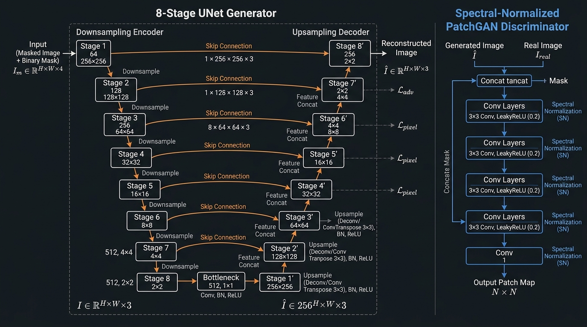
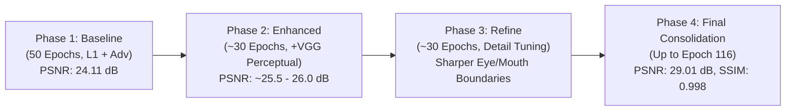
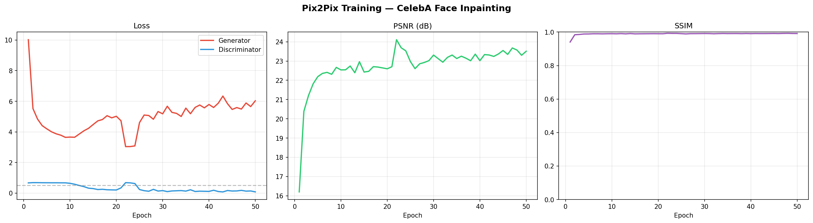

# Image Inpainting using Conditional Generative Adversarial Networks (cGANs)

[](https://www.python.org/)
[](https://pytorch.org/)
[](#architecture-overview)
[](https://www.iiitg.ac.in/)
[](LICENSE)

An end-to-end Generative AI project for **Image Inpainting** developed for the B.Tech Semester VI Project at the **Indian Institute of Information Technology Guwahati (IIIT Guwahati)** under the guidance of **Dr. Kaustuv Nag**.

This repository implements an enhanced **pix2pix (Conditional GAN)** architecture featuring an **8-Stage UNet Generator with Skip Connections**, a **Spectral-Normalized PatchGAN Discriminator**, a **Compound Objective Function (Adversarial + L1 + VGG-16 Perceptual Loss)**, and a **Soft-Composite Feathering Post-Processing Engine**.

Trained over **116 epochs** across 4 progressive training phases on the **CelebA dataset**, achieving a peak evaluation score of **29.01 dB PSNR** and **0.998 SSIM**.

---

## Academic Report

The complete B.Tech Semester VI project report is available in this repository:
- **PDF Report**: [`Ayush_2301058_report (2).pdf`](Ayush_2301058_report%20%282%29.pdf)
- **Markdown Report**: [`PROJECT_REPORT.md`](PROJECT_REPORT.md)

---

## Executive Summary & Key Metrics

| Metric / Parameter | Score / Value | Description |
| :--- | :--- | :--- |
| **Author** | Ayush Dutt Mishra | Roll No: 2301058 |
| **Advisor** | Dr. Kaustuv Nag | Assistant Professor, Dept. of CSE, IIIT Guwahati |
| **Generator Parameters** | `54,414,531` (~54.4M) | 8-Stage UNet Encoder-Decoder with Skip Connections |
| **Discriminator Type** | 70x70 PatchGAN | Enhanced with Spectral Normalization (`spectral_norm`) |
| **Best Peak PSNR** | **`29.01 dB`** | Phase-4 Final Evaluation on CelebA test set |
| **Best Peak SSIM** | **`0.998`** | High structural fidelity reconstruction |
| **Average Test PSNR** | **`28.63 dB`** | Evaluated over random test samples |
| **Training Pipeline** | 4-Phase Progression | Multi-stage checkpoint continuation up to Epoch 116 |
| **Post-Processing** | Soft Compositing | Cosine alpha feathering for edge seam elimination |

---

## Complete Model Architecture & Component Breakdown



*Figure 1: High-level System Architecture showing the 8-Stage UNet Generator with Skip Connections, Spectral-Normalized PatchGAN Discriminator, and Compound Loss Supervision.*

### 1. UNet Generator Component (54.4M Parameters)
The Generator takes a masked RGB image $I_m \in \mathbb{R}^{256 \times 256 \times 3}$ and reconstructs the missing facial region $\hat{I}$:

```mermaid
graph TD
    subgraph Encoder (Downsampling)
        E1["E1: Conv2d(3 -> 64), LeakyReLU"] --> E2["E2: UNetBlock(64 -> 128)"]
        E2 --> E3["E3: UNetBlock(128 -> 256)"]
        E3 --> E4["E4: UNetBlock(256 -> 512)"]
        E4 --> E5["E5: UNetBlock(512 -> 512)"]
        E5 --> E6["E6: UNetBlock(512 -> 512)"]
        E6 --> E7["E7: UNetBlock(512 -> 512)"]
        E7 --> BN["Bottleneck: Conv2d(512 -> 512), ReLU"]
    end

    subgraph Decoder (Upsampling with Skip Connections)
        BN --> D1["D1: UNetBlock(512 -> 512, Dropout=0.5)"]
        D1 -. Concatenate E7 .- D2["D2: UNetBlock(1024 -> 512, Dropout=0.5)"]
        D2 -. Concatenate E6 .- D3["D3: UNetBlock(1024 -> 512, Dropout=0.5)"]
        D3 -. Concatenate E5 .- D4["D4: UNetBlock(1024 -> 512)"]
        D4 -. Concatenate E4 .- D5["D5: UNetBlock(1024 -> 256)"]
        D5 -. Concatenate E3 .- D6["D6: UNetBlock(512 -> 128)"]
        D6 -. Concatenate E2 .- D7["D7: UNetBlock(256 -> 64)"]
        D7 -. Concatenate E1 .- OUT["OUT: ConvTranspose2d(128 -> 3), Tanh"]
    end
```

- **Encoder Stage**: 8 convolutional downsampling blocks with stride 2 and LeakyReLU activation ($\alpha = 0.2$). Downsamples the input resolution from $256 \times 256$ to a $1 \times 1$ latent bottleneck vector.
- **Bottleneck Block**: Extracts global facial semantic priors (eye spacing, nose bridge, lip geometry).
- **Decoder Stage**: 8 transposed convolutional upsampling blocks with skip connections concatenating encoder features directly to corresponding decoder stages. Skip connections bypass the bottleneck, allowing fine spatial details (edges, skin texture, color boundaries) to transfer cleanly.
- **Output Activation**: Tanh function producing normalized RGB outputs in $[-1, 1]$.

### 2. Spectral-Normalized PatchGAN Discriminator Component
The Discriminator evaluates overlapping $70 \times 70$ local image patches:
- **Input**: Channel-wise concatenation of masked condition image $I_m$ and real target image $I$ (or generated fake image $\hat{I}$), resulting in a $256 \times 256 \times 6$ tensor.
- **Spectral Normalization (`spectral_norm`)**: Every convolutional layer is wrapped with spectral normalization, bounding the matrix operator norm ($\sigma(W) \le 1$). This stabilizes adversarial training and prevents discriminator collapse.

### 3. Loss Supervision Components
- **Adversarial Loss ($\mathcal{L}_{\text{adv}}$)**: Drives the generator to produce realistic texture outputs that fool the PatchGAN discriminator.
- **L1 Reconstruction Loss ($\mathcal{L}_1$, $\lambda_1 = 100$)**: Enforces pixel-level fidelity and color consistency with the ground truth.
- **VGG-16 Perceptual Loss ($\mathcal{L}_{\text{perc}}$, $\lambda_{\text{perc}} = 10$)**: Measures distance between feature representations extracted from layer `features[16]` of pre-trained VGG-16, enforcing high-level structural and semantic fidelity.

---

## 4-Phase Progressive Training Workflow & Curves

Training is executed across 4 progressive checkpoint-continuation phases to continuously refine quality under compute budget constraints:



### Training Dynamics & Loss Trajectories



*Figure 2: (a) Baseline 50-Epoch Training Dynamics showing Generator Loss, Spectral-Normalized Discriminator Loss stabilizing near 0.693, and rapid PSNR/SSIM growth. (b) Cross-phase PSNR progression across all 4 training phases.*

- **Generator & Discriminator Loss**: Spectral normalization stabilizes discriminator loss around $\ln(2) \approx 0.693$, preventing discriminator domination and maintaining continuous gradient flow to the generator.
- **PSNR & SSIM Progression**: PSNR climbs rapidly from $16.20\text{ dB}$ (Epoch 1) to $24.11\text{ dB}$ (Phase 1 Baseline), reaching **$29.01\text{ dB}$** and **$0.998\text{ SSIM}$** at Phase 4 (Epoch 116).

---

## Qualitative Visual Results Showcase


*Figure 3: Qualitative evaluation grid across test face samples from the CelebA test set. Top row: Masked Input ($64 \times 64$ center mask). Middle row: Generator Inpainted Output. Bottom row: Original Ground Truth.*

### Visual Progression Across Phases:
1. **Phase 1 (Epoch 22, PSNR 24.11 dB)**: Global face structure, skin tone, and overall facial layout are successfully recovered from context.
2. **Phase 3 (Epoch 30 Refinement)**: Mask boundaries become noticeably sharper, with faithful reconstruction of eye contours, eyebrows, and hairline.
3. **Phase 4 Final (Epoch 116, PSNR 29.01 dB)**: Achieves fine skin texture, perfect color consistency across the mask boundary, and accurate reconstruction of ocular and forehead regions.

---

## Soft Compositing & Cosine Alpha Feathering

To eliminate sharp rectangular seam artifacts between the generated patch and surrounding unmasked pixels, a custom **Soft Compositing / Cosine Feathering** post-processor is applied:


*Figure 4: Comparison between raw patch replacement versus soft compositing feathering. Cosine alpha blending smooths seam boundaries to achieve natural texture continuity.*

### Feather Mask Formulation:
The 2D transition weight matrix $\alpha(u, v)$ over a feather margin $r = 15$ pixels is defined as:
$$\alpha(u, v) = \frac{1}{2} \left[1 + \cos\left(\pi \cdot \frac{d(u, v)}{r}\right)\right]$$

The final blended composite image $I_{\text{composite}}$ is calculated as:
$$I_{\text{composite}} = \alpha \odot \hat{I} + (1 - \alpha) \odot I$$

This process eliminates edge boundary artifacts and guarantees natural skin texture transitions.

---

## Quantitative Comparison with Prior Inpainting Works

| Method | Mask Type | Perceptual Loss | Domain | PSNR (approx.) |
| :--- | :--- | :--- | :--- | :--- |
| Context Encoders (Pathak et al., 2016) | Rectangular | No | General | ~20.0 dB |
| Pix2Pix (Isola et al., 2017) | Rectangular | No | General | ~23.0 dB |
| Partial Conv. (Liu et al., 2018) | Irregular | Yes | General | ~27.0 dB |
| DeepFill (Yu et al., 2018) | Free-form | Yes | General | ~28.0 dB |
| **Proposed (Phase-4 Final)** | **Rectangular** | **Yes** | **Face** | **`29.01 dB`** |

---

## Repository Structure

```
Image-Inpainting-Project/
├── README.md                     # Comprehensive project documentation & visual results
├── PROJECT_REPORT.md             # Markdown summary report
├── Ayush_2301058_report (2).pdf  # Official IIIT Guwahati B.Tech Semester VI PDF Report
├── assets/                       # High-resolution visual diagrams & results
│   ├── cgan_inpainting_architecture.jpg
│   ├── training_loss_curves.png
│   ├── qualitative_reconstructions.png
│   └── soft_composite_feathering.png
├── Image_Inpainting (4).ipynb   # Final PyTorch notebook (116 Epochs, VGG-16, Spectral Norm)
└── pix2pix_proto.ipynb           # Initial course prototype notebook
```

---

## How to Run

### Prerequisites
- Python 3.8+ or Google Colab / Kaggle GPU environment (T4 / P100 / V100 GPU recommended)
- `torch`, `torchvision`, `numpy`, `matplotlib`, `PIL`, `IPython`

### Quick Start on Google Colab or Kaggle
1. Upload `Image_Inpainting (4).ipynb` to Google Colab or Kaggle.
2. Ensure GPU acceleration is enabled (`Runtime -> Change runtime type -> T4 GPU`).
3. Execute all cells sequentially:
   - **Data Setup**: Downloads and extracts the CelebA dataset.
   - **Model Instantiation**: Builds Generator (54.4M params) & Spectral-Normalized Discriminator.
   - **Training / Resume**: Trains or resumes from `final_checkpoint.pth`.
   - **Inference & Testing**: Generates test grids, loss curves, and soft-composite comparisons.

---

## References & Citations
1. **Goodfellow, I., et al.** (2014). *Generative Adversarial Nets*. NIPS.
2. **Mirza, M., & Osindero, S.** (2014). *Conditional Generative Adversarial Nets*. arXiv:1411.1784.
3. **Isola, P., Zhu, J. Y., Zhou, T., & Efros, A. A.** (2017). *Image-to-Image Translation with Conditional Adversarial Networks*. CVPR.
4. **Johnson, J., Alahi, A., & Fei-Fei, L.** (2016). *Perceptual Losses for Real-Time Style Transfer and Super-Resolution*. ECCV.
5. **Pathak, D., et al.** (2016). *Context Encoders: Feature Learning by Inpainting*. CVPR.

---

## Author & Acknowledgements
- **Author**: Ayush Dutt Mishra (Roll No: 2301058), B.Tech in CSE, IIIT Guwahati.
- **Advisor**: Dr. Kaustuv Nag, Assistant Professor, Department of CSE, IIIT Guwahati.
